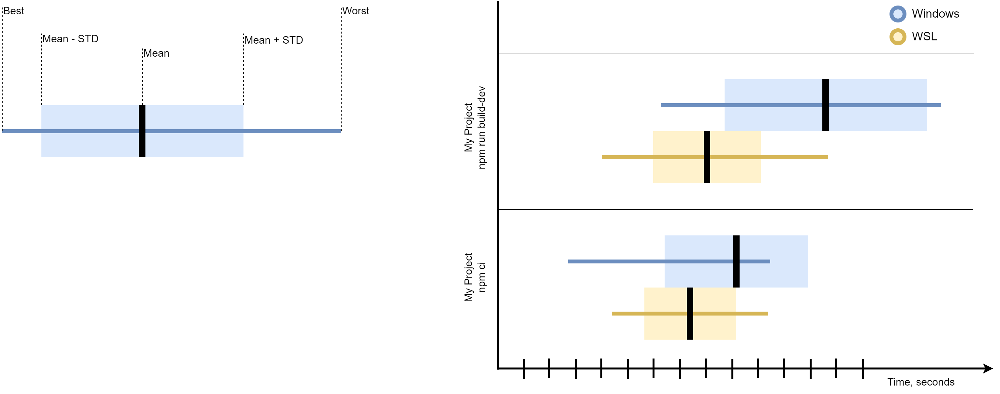

# Dev Bench

Designed to benchmark performance of PCs/Laptops/WSL/etc when working on NodeJS-based Front-End projects.

## Getting Started

1. Clone this repo
2. Install `nodeenv`:
  - MacOS (using [Homebrew](https://brew.sh/)): `brew install nodeenv`
  - Ubuntu/WSL: check [nodeenv installation docs](https://github.com/ekalinin/nodeenv#install), ensure that `nodeenv` command is available in your PATH
3. Run `npm ci` to install deps
4. Copy `config.example.ts` to `config.ts`
5. Modify `config.ts` to your liking (add projects, commands, optionally patches, etc.), see [Configuration](#configuration)
6. Run `npm start` (or `npm start -- --run-indefinitely`)
7. See results in CLI (mean ± standard deviation):

   ```
   Benchmarking "build"...
   Average: 10s ±132ms
   Benchmarking "unit test"...
   Average: 45s ±12s
   ```

   and more details in `results.json` file

### CLI Options

`--run-indefinitely` - when set, will re-run benchmarks for all projects until you stop the process manually (using Ctrl+C). Useful for when you can leave device running for long and want to get more precise benchmark results. Note: `afterAll()` hooks won't run in this case, which might affect reporters <!--TODO: detect Ctrl+C and run `afterAll()` hooks -->

### Configuration

#### Project configuration

Available options:

- `name`: the name of your project
- `gitUrl`: URL of your Git repository to clone (make sure credentials are saved before running benchmarks)
- `gitCliConfigOverrides`: key-value object, will be passed to `git clone -c your=option -c another=option` to override global config options, such as `autocrlf`, etc.
- `rootFolder`: this is your NodeJS root folder (where the `package.json` is). If you have multiple projects within the same repo - add multiple project entries with different root folders
- `patches`: _optional_ array of patches to apply, requires `name` and `file` options, see [patching](#patching)
- `commands`: an array of commands to be benchmarked, see [commands](#commands)

#### Commands

Commands are what being benchmarked, common examples: `npm ci`, `npm test`, `npm run build`, etc.

Every command needs a `name`.

Types of commands (only one per command):

- `npmScriptName` - will call `npm run ${npmScriptName}`, for example `npmScriptName: "build-dev"`
- `npxCommand` - will call `npx ${npxCommand}`, for example: `npxCommand: "jest"`
- `npmCommand` - will call `npm ${npmCommand}`, for example: `npmCommand: "ci"`

#### Patching

Patching can be useful to disable certain tests, change scripts, engines, etc. It's run right after cloning, before installing nodeenv and npm modules.

Available patching options:

- replace: set `search: "find-me"` and `replace: "replace-with-me"` - it'll replace first occurrence
- delete: set `delete: true` - will delete file
- append: set `append: "some-string"` - will append to file

Note: all patching options are exclusive <!-- TODO: make it apparent in types -->

### Extensibility

The system supports multiple reporters that extend [`Reporter` class](./reporters/Reporter.ts).

Available reporters:

- `cli` - logs totals, averages and deviation to stdout
- `fs` - preserves reports into `results.json` file
- `chart` - saves visual representation in `results.png` file

All reporters have to implement `collectResult()` method that is called after each command is benchmarked.

Some reporters may choose to implement `afterAll()` method that is called after all benchmarks are done for all projects.

## Troubleshooting

- Enable debug logging: `npx -y cross-env DEBUG=true npm start` and look in `log.txt`

## TODO

- [ ] Add visual comparison of results:  using [Vega](https://vega.github.io/editor) [prototype](design.json)
  - [ ] Need to figure out how to implement this. Just adding it as a reporter doesn't make a lot of sense because in a given environment we only have results from that environment. Maybe consider creating a Gist reporter that will upload/append results to a Gist - and then chart can be generated based on all those results.
- [ ] Related to previous point: think how can we make managing results easier for the end user.
- [ ] Maybe pull config from Gist - this way user can make Gist public and avoid having to auth in all envs
